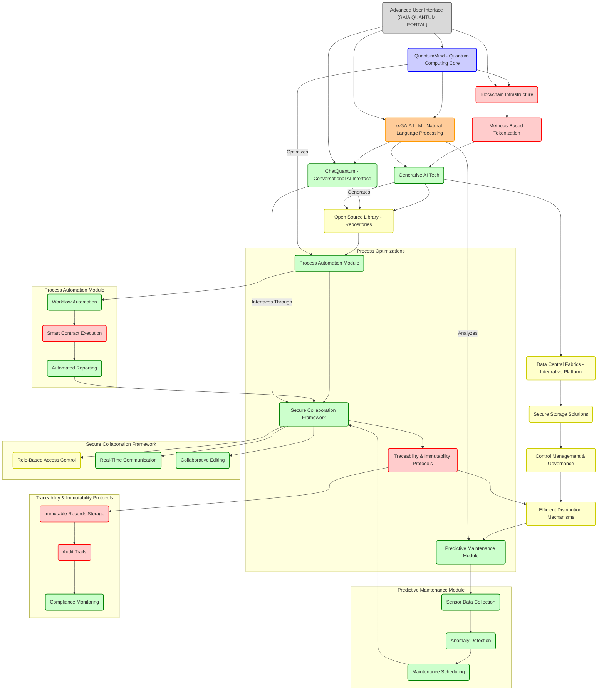

Author: Amedeo Pelliccia 
date: 16/01/2025

#```markdown
# GAIA QUANTUM PORTAL (GQP) - Aerospace AI Reference Hub

**Date:** [Insert Date]  
**Prepared by:** Amedeo Pelliccia (Robbbo-T)

<span class="note">The GQP serves as a reference hub for all AI-related activities in the aerospace sector and its industrial environment, making it indispensable for current and future airlines and aircraft manufacturers. Following the AMPEL SD philosophy, modularity, adaptability, ecological efficiency, and "lungimiranza" are central to offering a scalable, customizable, and programmable environment at any level of the aerospace ecosystem.</span>

---

## **1. Introduction**

- **Vision:**
  - To create a revolutionary digital ecosystem that enhances efficiency, transparency, collaboration, and sustainability within the aerospace and defense industry.
  - Leverage cutting-edge technologies such as blockchain, quantum computing, artificial general intelligence (AGI), and large language models (LLMs).

- **Mission:**
  - Digitally transform the industry through methods-based tokenization, intelligent process automation, advanced data analytics, and knowledge management.
  - Empower these transformations with **e.GAIA LLM** and **QuantumMind**.

- **Impact:**
  - Cost reduction.
  - Enhanced operational efficiency.
  - Increased security.
  - Promotion of innovation and sustainability within the industry.

---

## **2. Core Components**

### **2.1 Blockchain Infrastructure**


- **Role:**
  - Serves as the foundational infrastructure for traceability, security, and data immutability.

- **Key Functions:**
  - Immutable recording of each stage in the product lifecycle.
  - Tokenization of physical assets and processes (NFTs and fungible tokens).
  - Smart contracts to automate transactions and processes.
  - Interoperability between various stakeholders and systems.

### **2.2 Methods-Based Blockchain Tokenization**


- **Core Concept: Methods-Based Blockchain Tokenization**
  - **Definition:**
    - Represents not only physical assets or data but also **methods**—the processes, procedures, algorithms, and instructions used in the aerospace and defense industry—as tokens on the blockchain.
  - **Benefits:**
    - **Standardization:** Methods become standardized, reusable, and easily verifiable.
    - **Traceability:** Tracks the evolution, application, and modification of methods on the blockchain.
    - **Composability:** Methods can be combined to create complex processes, with each step tracked and validated.
    - **Automation:** Methods can be automated, enhancing efficiency and reducing errors.
    - **IP Protection:** Establishes ownership and control over intellectual property.
    - **Collaboration and Sharing:** Enables secure sharing and licensing within a controlled ecosystem.

- **Supporting Infrastructure:**
  - **Generative Tech:**
    - Utilizes AI (e.g., **e.GAIA LLM** and **QuantumMind**) to generate, refine, and optimize methods.
    - Automatically creates documentation and training materials for tokenized methods.
  - **Data Central Fabrics:**
    - A unified data infrastructure integrating data from sensors, CAD/CAM systems, PLM, ERP, MES, and more.
    - Ensures data integrity and consistency using blockchain's immutability.
    - Enables secure data sharing based on roles and permissions.
  - **Storage:**
    - Secure and scalable storage solutions for tokenized methods, associated metadata, and generated data.
    - Utilizes advanced encryption and redundant storage for data protection and availability.
  - **Control Management:**
    - Manages access control, versioning, workflow automation, and compliance.
    - Implements role-based access control (RBAC) and smart governance policies.
  - **Distribution:**
    - Secure and efficient distribution mechanisms for tokenized methods.
    - Facilitates discovery, deployment, licensing, and monetization through smart contracts and secure protocols.

### **2.3 Artificial Intelligence (AI) and Machine Learning**


- **Role:**
  - Enables intelligent automation, predictive analytics, and process optimization.

- **Key Applications:**
  - Predictive maintenance based on historical and real-time data.
  - Pattern analysis to identify risks, inefficiencies, and opportunities.
  - Automation of administrative and technical tasks.

### **2.4 Quantum Computing (QuantumMind)**


- **Role:**
  - Acts as the quantum intelligence core to solve complex problems, optimize processes, and enhance security.

- **Key Functionalities:**
  - Quantum algorithms for design, logistics, and production optimization.
  - Post-quantum cryptography to secure critical data.
  - Advanced simulation capabilities for informed decision-making.
  - High-speed and large-scale data analysis.

### **2.5 e.GAIA LLM (Large Language Model)**


- **Role:**
  - Serves as the digital brain, processing, analyzing, interpreting, and generating technical information in real-time to support decision-making.

- **Key Functionalities:**
  - Continuous training with technical and operational data.
  - Advanced Natural Language Processing (NLP) for understanding and generating technical documentation.
  - Predictive and prescriptive analytics for process optimization.
  - Automatic generation of reports, manuals, and technical guides.
  - Advanced technical support as a specialized virtual assistant.
  - Integration with QuantumMind for complex analyses and simulations.

### **2.6 ChatQuantum**


- **Role:**
  - An intelligent conversational interface facilitating interaction between humans and the ecosystem's AI components.

- **Key Functionalities:**
  - Coordination of specialized AI agents.
  - Advanced contextual dialogues powered by **e.GAIA LLM**.
  - Integration with **QuantumMind** for real-time analysis.

### **2.7 Library of Open Source Code (Tokenized Methods)**


- **Function:**
  - A repository of standardized, tokenized industrial processes.

- **Benefits:**
  - Transparency and collaboration in process development.
  - Standardization and optimization across the industry.
  - Immutable traceability of process evolution.
  - Facilitates auditing and regulatory compliance.

### **2.8 Advanced User Interface (GAIA QUANTUM PORTAL)**


- **Key Features:**
  - Interactive and customizable dashboards.
  - Integration of Augmented Reality (AR) and Virtual Reality (VR) for immersive visualizations and simulations.
  - Multichannel access (desktop, mobile, tablet).
  - Intuitive, user-centered design.

### **2.9 QuantumMind**


- **Role:**
  - Embedded quantum intelligence within ChatQuantum and the GAIA ecosystem, serving as the cognitive core.

- **Key Functions:**
  - Real-time processing and analysis of complex data.
  - Optimization of processes using quantum algorithms.
  - Support for advanced simulations and decision-making.

### **2.10 Real-Time Templates Builder and Dispatcher**


- **Description:**
  - A tool for creating and managing technical document templates in real-time, integrated with sensors and QuantumMind.

- **Workflow:**
  1. **Sensoring Receptor:** IoT devices capture real-time data.
  2. **QLINK Transmission:** Secure transmission of data to QuantumMind.
  3. **QuantumMind:** Processes and structures the information.
  4. **e.GAIA (Engine.G):** Orchestrates the information flow and executes library functions.
  5. **GAIA LLM Processing:** Generates technical prompts based on data.
  6. **ChatQuantum:** Presents and explains the generated content to the user in various formats.

- **Example Scenario: Creation of a Maintenance Manual**
  - **Author Input:** Specifies manual type, task, and component details.
  - **Data Capture:** Sensors collect relevant data transmitted to QuantumMind.
  - **Information Structuring:** QuantumMind organizes data and creates a technical prompt for GAIA LLM.
  - **Manual Draft Generation:** GAIA LLM fills the template with specific component and sensor data.
  - **Presentation and Validation:** ChatQuantum displays the draft in multiple formats for review and approval.
  - **Storage and Versioning:** The validated manual is recorded on the blockchain as an NFT, ensuring traceability and version control.

---

## **3. Functionalities of the GAIA QUANTUM PORTAL**

### **3.1 Immutable Product Lifecycle Registration**


- **Description:**
  - Each phase, from design to final disposition, is recorded on the blockchain through open-source library functions and interactions with **e.GAIA LLM**.

- **Recorded Information:**
  - Unique identifier of the product/component.
  - Detailed description of processes or events.
  - Results from tests, inspections, and validations.
  - Data generated by **e.GAIA LLM** and **QuantumMind**.
  - History of changes and ownership transfers (tokens).

### **3.2 Traceability and Transparency**


- **Description:**
  - Provides authorized parties with complete and verifiable information about the product.

- **Example:**
  - A maintenance operator can verify component specifications, maintenance history, and associated certifications.

### **3.3 Intelligent Process Automation**


- **Description:**
  - Smart contracts, powered by **e.GAIA LLM** and **QuantumMind**, automate:
    - Token ownership transfers.
    - Payments between suppliers and manufacturers.
    - Report and audit generation.
    - Activation of predictive maintenance processes.

### **3.4 Secure and Efficient Collaboration**


- **Description:**
  - Blockchain-based authentication and robust identity management.
  - A connected ecosystem facilitating interaction among manufacturers, suppliers, regulators, and customers via **ChatQuantum**.

### **3.5 Advanced Prediction, Optimization, and Simulation**


- **Description:**
  - **QuantumMind** and **e.GAIA LLM** collaborate to:
    - Anticipate failures and schedule proactive maintenance.
    - Optimize logistics routes, production flows, and complex designs.
    - Reduce design and development times through advanced simulations.
    - Assess the impact of regulatory changes or unexpected events.

---

## **4. Impact on the Industry**

### **4.1 Enhanced Operational Efficiency**


- Elimination of redundancies and reduction of cycle times.
- Intelligent automation of administrative, technical, and management tasks.

### **4.2 Reinforced Security**


- Advanced cryptography, including post-quantum methods, to protect sensitive data.
- Immutable records preventing alterations, fraud, and counterfeiting.

### **4.3 Sustainability**


- Resource optimization to minimize waste and carbon footprint.
- Efficient management of component disposal and recycling.

### **4.4 Global Collaboration and Standardization**


- Establishment of a global standard for digital management in the aerospace and defense industry.
- Facilitation of interoperability among different organizations and systems.

---

## **5. Use Cases**

### **5.1 Comprehensive Product Lifecycle Management**


- Complete traceability from conceptual design to final disposition, including manufacturing, operation, and maintenance.
- Immutable recording of inspections, repairs, updates, and certifications.

### **5.2 Supply Chain Optimization**


- Real-time visualization of logistical flows powered by **e.GAIA LLM**.
- Predictive simulations to anticipate and resolve bottlenecks with **QuantumMind** assistance.

### **5.3 Advanced and Automated Technical Documentation**


- Creation of interactive and personalized manuals accessible via AR/VR.
- Automatic updating of documentation based on blockchain records and **e.GAIA LLM** analysis.

### **5.4 Predictive and Prescriptive Maintenance**


- Identification of failure patterns using AI and **e.GAIA LLM**.
- Proactive maintenance scheduling to prevent operational interruptions, optimized by **QuantumMind**.

### **5.5 Design and Simulation with AGI Support**


- **GAIA AIR**'s AGI capabilities support the design of complex systems.
- Advanced simulations considering multiple variables and scenarios, optimized by **QuantumMind**.

### **5.6 Real-Time Templates Builder and Dispatcher**


- **Workflow:**
  1. **Sensoring Receptor:** Real-time data capture via IoT devices.
  2. **QLINK Transmission:** Secure data transmission to **QuantumMind**.
  3. **QuantumMind:** Data processing and structuring.
  4. **e.GAIA (Engine.G):** Orchestration and execution of library functions.
  5. **GAIA LLM Processing:** Technical prompt generation for document creation.
  6. **ChatQuantum:** Presentation and explanation of generated content in various formats.

- **Example Scenario: Creation of a Maintenance Manual**
  - **Author Input:** Details about manual type, task, and component specifications.
  - **Data Capture:** Relevant sensor data transmitted to **QuantumMind**.
  - **Information Structuring:** **QuantumMind** organizes data and creates a technical prompt for **e.GAIA LLM**.
  - **Manual Draft Generation:** **e.GAIA LLM** fills the template with specific component and sensor data.
  - **Presentation and Validation:** **ChatQuantum** displays the draft in multiple formats for review and approval.
  - **Storage and Versioning:** Validated manual recorded on the blockchain as an NFT, ensuring traceability and version control.

---

## **6. Challenges and Solutions**

### **6.1 Challenges**

- **Technical Complexity:**
  - Integration of emerging technologies like blockchain, quantum computing, and AGI.

- **Industry Adoption:**
  - Necessity for widespread adoption to achieve standardization and interoperability.

- **Data Sensitivity Management:**
  - Protecting confidential data within a distributed environment.

- **Quantum Computing Development:**
  - Maturation and availability of quantum technologies.

- **Scalability:**
  - Infrastructure capacity to handle large volumes of data and transactions.

### **6.2 Solutions**

- **Iterative and Phased Development:**
  - Gradual implementation with functional prototypes and pilot tests.

- **Strategic Alliances:**
  - Collaborations with technological leaders and key industry stakeholders.

- **Robust Security and Privacy Standards:**
  - Implementation of post-quantum cryptography and strong access control mechanisms.

- **Hybrid Approach:**
  - Combining classical and quantum computing to maximize efficiency and adaptability.

---

## **7. Key Entities**

### **7.1 e.GAIA**


- **Description:**
  - Entity responsible for the development, implementation, and management of the **GAIA QUANTUM PORTAL**.
  - Leader in the digital transformation of the aerospace and defense industry.

### **7.2 GAIA AIR**


- **Description:**
  - Entity specialized in Artificial General Intelligence (AGI).
  - Responsible for pre-genesis analyses and developing AGI capabilities for the ecosystem.
  - Industry benchmark for AGI applications in the sector.

### **7.3 QuantumMind**


- **Description:**
  - The quantum intelligence core of the GAIA ecosystem.
  - Integrated with **e.GAIA LLM** and **ChatQuantum** for advanced analyses and optimizations.

---

## **8. Conclusion**

The **GAIA QUANTUM PORTAL**, powered by **e.GAIA**, **GAIA AIR**, **e.GAIA LLM**, and **QuantumMind**, embodies a bold and transformative vision for the aerospace and defense industry. By integrating emerging technologies such as blockchain, methods-based tokenization, quantum computing, AGI, LLMs, and advanced user interfaces, the portal offers unparalleled traceability, transparency, intelligent automation, and collaboration.

Adopting this platform will position the industry at the forefront of innovation, efficiency, and sustainability, preparing it for future challenges and opportunities. The implementation of **GAIA QUANTUM PORTAL** sets a new standard for digital management in the industry, with potential impacts comparable to the introduction of the Internet in other sectors.

---

## **9. Recommendations for Advancing the Proposal**

1. **Development of Standardized Templates:**
   - Collaborate with industry experts to create tokenization templates that comply with relevant standards and regulations.

2. **Integration of Generative Technologies:**
   - Implement and train AI models to automate the creation and management of methods-based tokens.

3. **Strengthening Data Infrastructure:**
   - Develop a robust **Data Central Fabrics** infrastructure capable of handling large data volumes while ensuring quality and consistency.

4. **Implementation of Advanced Security Protocols:**
   - Utilize post-quantum encryption and other security measures to protect sensitive data and ensure token integrity.

5. **Automation of Token Distribution:**
   - Develop smart contracts to facilitate the automatic and secure distribution of tokens based on predefined conditions.

6. **Training and Education:**
   - Educate users and stakeholders about the functionalities and benefits of **Methods-Based Blockchain Tokenization**, promoting adoption and effective utilization.

7. **Continuous Monitoring and Auditing:**
   - Implement auditing mechanisms to oversee tokenization activities and ensure compliance with established policies and standards.

---

## **10. Next Steps**

- **Concept Validation:**
  - Validate each ecosystem component through technical testing and industrial pilot projects.

- **Funding and Resources:**
  - Seek investors, grants, and other resources to support development and implementation.

- **Community Development:**
  - Build a community of developers and users to contribute to the open-source library and the GAIA ecosystem.

---

## **Example Scenario: Real-Time Templates Builder and Dispatcher**

**Scenario: Creating a Maintenance Manual for a Pre-Production Series Aerospace Program**

**Components Involved:**
- **Sensoring Receptor:** IoT devices collecting real-time data.
- **QLINK Transmission:** Secure data transfer protocol.
- **QuantumMind:** Processes and directs structured information.
- **e.GAIA (Engine.G):** Orchestrates information flow and executes library functions.
- **GAIA LLM:** Generates technical prompts for document creation.
- **ChatQuantum:** Presents and explains the generated content to the user.

**Workflow:**

1. **Data Capture and Author Request:**
   - **Technical Author:** Initiates the creation of a maintenance manual for a specific task (e.g., "Landing Gear Inspection").
   - **Input Provided:**
     - Manual Type: "Component Maintenance Manual (CMM)"
     - Task Type: "Periodic Inspection"
     - System: "Landing Gear"
     - Component: "Main Shock Absorber"
     - Part Number: "XXX-YYYY-ZZZZ"
   - **Sensor Data:** IoT sensors collect relevant data (vibration, temperature, pressure).

2. **Template Activation:**
   - **ChatQuantum:** Identifies the need for a structured document template based on the provided details and activates the "Templates Builder" module.

3. **Data Processing and Routing:**
   - **QLINK Transmission:** Transmits the author’s request and sensor data securely to **QuantumMind**.
   - **QuantumMind:**
     - Analyzes the request and sensor data using quantum processing capabilities.
     - Determines the appropriate template and applicable standards (e.g., ATA Spec 2200).
     - Structures the information into a "technical generative prompt" for **GAIA LLM**.
   - **e.GAIA (Engine.G):**
     - Orchestrates data flow and executes library functions to retrieve relevant standard sections.

4. **Draft Generation:**
   - **GAIA LLM:**
     - Receives the prompt and accesses its knowledge base, including program data, technical manuals, and regulations.
     - Fills the selected CMM template with specific component and sensor data.
     - Generates a comprehensive draft, including:
       - Detailed task descriptions.
       - Step-by-step inspection procedures.
       - Reference sensor data values.
       - Relevant regulatory directives.

5. **Presentation and Validation:**
   - **ChatQuantum:**
     - Presents the manual draft to the author in various formats (screen display, audio narration, video explanation, dynamic hologram).
     - Allows the author to review, edit, and validate the content.
     - Provides suggestions and corrections based on **GAIA LLM** and **QuantumMind** insights.

6. **Storage and Version Control:**
   - **Blockchain:**
     - Once validated, the manual is recorded as an NFT on the blockchain, ensuring an immutable record of its creation, authorship, and content.
     - The updated template and its modification history are also stored on the blockchain for future reference.

---

## **Benefits of Applying This Case Across the Entire Component Lifecycle**

- **Complete Traceability:** Establishes an immutable record of each component's history from conception to retirement.
- **Transparency:** Provides stakeholders with access to relevant information, fostering trust and collaboration.
- **Enhanced Efficiency:** Automates and optimizes processes, reducing costs and cycle times.
- **Assured Quality:** Continuous quality control and data analysis prevent failures and enhance product reliability.
- **Sustainability:** Optimizes material usage and responsibly manages component retirement, contributing to a more sustainable industry.
- **Continuous Innovation:** Data-driven insights from **e.GAIA LLM** and **QuantumMind** drive ongoing innovation and process improvements.

---

## **Enhanced Mermaid Diagram for GAIA QUANTUM PORTAL**

To provide a clear and detailed visualization of the GAIA QUANTUM PORTAL ecosystem, the following Mermaid diagram captures the hierarchical structure, color-coding, and interactions between core components and supporting functions. This diagram also includes subgraphs for complex processes, enhancing readability and understanding.



---

## **HTML and Functional Requirements Management**

### **1. HTML Interface Design**

**Structure:**
- **Sections:** Organized into various sections such as Ecosystem, AI, PLM, CAD, ICSDB, TechRequest, Data Hub, IoT Inventories, Route Optimization, Predictive Maintenance, Material Simulator, Sustainability, and ChatQuantum.
- **Navigation:** A top navigation menu allows easy access to different sections, enhancing user experience.
- **Data Management:** Utilizes DataTables to provide interactive features like pagination, searching, and sorting for the requirements list.

**Implementation Example:**
Below is an example of how to structure your HTML interface with dynamic loading of functional requirements using JSON and JavaScript.

### **2. Requirements Table**

**Data Presentation:**
- Functional requirements (FR1 to FR260) are displayed in a table format, showcasing ID, Type, Description, Category, Priority, and Status.

**Dynamic Loading:**
- Instead of hardcoding the requirements into the HTML, load them dynamically from a JSON source. This approach simplifies maintenance and updates.

### **3. Steps to Improve and Use Dynamic Content**

**Dynamic Data Handling:**

Here is an example demonstrating how to manage and present your requirements dynamically using JSON and JavaScript:

### **HTML Structure with Dynamic Requirements Loading**

```html
<!DOCTYPE html>
<html lang="en">
<head>
    <meta charset="UTF-8"/>
    <meta name="viewport" content="width=device-width, initial-scale=1.0"/>
    <title>GAIA QUANTUM PORTAL (GQP) - Aerospace AI Reference Hub</title>
    <style>
        body {
            font-family: Arial, sans-serif;
            margin: 2rem;
            background: #f9f9f9;
        }
        h1, h2, h3, h4 {
            font-family: "Helvetica Neue", Helvetica, Arial, sans-serif;
            color: #333;
        }
        h1 {
            border-bottom: 2px solid #333;
            padding-bottom: 0.5rem;
        }
        nav {
            background: #333;
            padding: 1rem;
            margin-bottom: 2rem;
        }
        nav a {
            color: #fff;
            margin-right: 1.5rem;
            text-decoration: none;
            font-weight: bold;
        }
        nav a:hover {
            text-decoration: underline;
        }
        section {
            margin-bottom: 2rem;
        }
        .note {
            font-style: italic;
            color: #555;
        }
        table {
            width: 100%;
            border-collapse: collapse;
            background: #fff;
            margin-bottom: 2rem;
        }
        th, td {
            text-align: left;
            padding: 0.75rem;
            border-bottom: 1px solid #ccc;
            vertical-align: top;
        }
        th {
            background: #eee;
            font-weight: bold;
        }
        tr:hover {
            background: #f1f1f1;
        }
        .category {
            font-style: italic;
            color: #555;
        }
        .priority-high {
            font-weight: bold;
            color: #d00;
        }
        .priority-medium {
            font-weight: bold;
            color: #c90;
        }
        .priority-low {
            font-weight: normal;
            color: #090;
        }
        .status-pendiente {
            color: #d00;
            font-weight: bold;
        }
        .assistant-container {
            position: fixed;
            top: 20%;
            right: 2%;
            background: #fff;
            border: 2px solid #ccc;
            padding: 1rem;
            width: 250px;
            box-shadow: 0 0 10px rgba(0,0,0,0.2);
        }
        .assistant-container h3 {
            margin-top:0;
        }
        .assistant-container p {
            font-size: 0.9rem;
        }
        .assistant-input {
            margin-top:0.5rem;
        }
        .assistant-input input[type="text"] {
            width: 100%;
            padding: 0.5rem;
            box-sizing: border-box;
            font-size:0.9rem;
        }
        .assistant-input button {
            margin-top:0.5rem;
            padding: 0.5rem;
            font-size:0.9rem;
            background: #333;
            color: #fff;
            border: none;
            cursor: pointer;
        }
        .assistant-input button:hover {
            background: #555;
        }
        /* Collapsible Categories */
        .collapsible {
            cursor: pointer;
            padding: 0.75rem;
            text-align: left;
            border: none;
            outline: none;
            font-size: 1rem;
            background-color: #eee;
            width: 100%;
            transition: background-color 0.3s;
        }
        .active, .collapsible:hover {
            background-color: #ccc;
        }
        .content {
            padding: 0 1rem;
            display: none;
            overflow: hidden;
            background-color: #f9f9f9;
        }
    </style>
    <!-- DataTables CSS -->
    <link rel="stylesheet" type="text/css" href="https://cdn.datatables.net/1.13.4/css/jquery.dataTables.css">
</head>
<body>

    <!-- Navigation Menu -->
    <nav>
        <a href="#ecosystem">Ecosystem</a>
        <a href="#ai">Aerospace AI</a>
        <a href="#plm">PLM</a>
        <a href="#cad">CAD</a>
        <a href="#icsdb">I-CSDB</a>
        <a href="#techrequest">TechRequest</a>
        <a href="#datahub">Data Hub</a>
        <a href="#inventories">IoT Inventories</a>
        <a href="#routes">Route Optimization</a>
        <a href="#maintenance">Predictive Maintenance</a>
        <a href="#material">Material Simulator</a>
        <a href="#sustainability">Sustainability</a>
        <a href="#chatquantum">ChatQuantum</a>
    </nav>

    <h1>GAIA QUANTUM PORTAL (GQP) - Aerospace AI Reference Hub</h1>
    <p><strong>Date:</strong> [Insert Date]<br>
    <strong>Prepared by:</strong> Amedeo Pelliccia (Robbbo-T)<br>
    <span class="note">The GQP serves as a reference hub for all AI-related activities in the aerospace sector and its industrial environment, making it indispensable for current and future airlines and aircraft manufacturers. Following the AMPEL SD philosophy, modularity, adaptability, ecological efficiency, and "lungimiranza" are central to offering a scalable, customizable, and programmable environment at any level of the aerospace ecosystem.</span></p>

    <section id="ecosystem">
        <h2>Ecosystem Modular and Adaptable</h2>
        <p>The GQP is a 360° digital ecosystem entirely in the cloud, designed to cater to different user profiles: engineers, operators, analysts, project managers, sustainability officers, and more. Each profile can configure modules, views, dashboards, and tools according to their needs, supporting the AMPEL SD methodology, which emphasizes modularity, scalability, and modelica adaptability.</p>
        <p>The personalized structure is achieved through open APIs, microservices, and a composable-oriented architecture, allowing each airline or aircraft manufacturer to adopt, modify, and integrate GQP AI modules into their own infrastructure or cloud workflows.</p>
    </section>

    <section id="ai">
        <h2>Aerospace AI and Industrial</h2>
        <p>GQP integrates quantum AI, machine learning, deep learning, and hybrid algorithms to optimize routes, maintenance, design, material selection, inventory management, and more. This AI evolves with real-time data, continuous learning, and CI/CD, adapting to new conditions, regulations, emerging technologies, and market demands.</p>
    </section>

    <section id="plm">
        <h2>PLM (Product Lifecycle Management)</h2>
        <p>Comprehensive management of the aircraft lifecycle, from conceptual design to retirement, including maintenance, updates, and continuous improvements. Complies with ATA 100, ABD0036, and leverages modularity and "lungimiranza" to anticipate future needs.</p>
    </section>

    <section id="cad">
        <h2>CAD</h2>
        <p>3D CAD tools in the cloud, integrated with digital twins, FEM, quantum simulations, remote co-design, and AI-adjusted configurations to optimize aerospace design.</p>
    </section>

    <section id="icsdb">
        <h2>I-CSDB</h2>
        <p>Intelligent Centralized Database, integrating configurations, structural data, and operational data. The AMPEL SD modularity allows easy incorporation of new data types, support for multiple standards, and long-term coherence maintenance.</p>
    </section>

    <section id="techrequest">
        <h2>TechRequest</h2>
        <p>Tool for requesting technical information, data, and analyses, managed in the cloud, scalable, and secure. Adjustable by profile and compatible with CI/CD workflows.</p>
    </section>

    <section id="datahub">
        <h2>Data Hub</h2>
        <p>Centralized storage and management of sensor data, flights, materials, inventories, and more. This "memory" in the cloud leverages Big Data and ML to extract value, feed AI, and provide insights to all modules.</p>
    </section>

    <section id="inventories">
        <h2>IoT Inventories</h2>
        <p>Global monitoring of parts, materials, spare parts, and supplies in real-time. AI recommends sourcing strategies, reduces costs, and ensures quality, applying modularity and scalability to adapt to any fleet size or operational complexity.</p>
    </section>

    <section id="routes">
        <h2>Route Optimization and Trackers</h2>
        <p>A quantum AI service optimizes routes in real-time based on weather, traffic, and energy consumption. Customized dashboards display KPIs for efficiency, punctuality, and safety, enabling current and future airlines to continuously improve their operations.</p>
    </section>

    <section id="maintenance">
        <h2>Predictive Maintenance</h2>
        <p>An analytical engine converts sensor data, histories, and context into intelligent maintenance plans, issuing preventive recommendations. This reduces downtime, costs, and ensures the longevity of the aircraft, in line with the AMPEL SD philosophy and emphasis on ecological efficiency.</p>
    </section>

    <section id="material">
        <h2>Material Simulator</h2>
        <p>AI tool to simulate different materials, their performance under extreme conditions, fatigue, vibrations, and climatic changes. Allows current and future aircraft manufacturers to select optimal materials, minimizing environmental impact and maximizing durability.</p>
    </section>

    <section id="sustainability">
        <h2>Sustainability and Lungimiranza</h2>
        <p>GQP integrates LCA analysis, energy optimization, and emission reduction. Its "lungimiranza" and ecological efficiency ensure a platform adaptable to changing environmental regulations and the adoption of new green technologies. Each module can be reconfigured to align with long-term environmental and commercial goals.</p>
    </section>

    <section>
        <h2>GQP Functional Requirements</h2>
        <p>The table below displays a comprehensive list of functional requirements (FR1 to FR260), organized by categories. These requirements are customizable, scalable, and managed with CI/CD in the cloud.</p>
        
        <!-- Collapsible Categories for Better Organization -->
        <button type="button" class="collapsible">Product Lifecycle Management (PLM)</button>
        <div class="content">
            <table id="plmTable">
                <thead>
                    <tr>
                        <th>ID</th>
                        <th>Type</th>
                        <th>Description</th>
                        <th>Category</th>
                        <th>Priority</th>
                        <th>Status</th>
                    </tr>
                </thead>
                <tbody>
                    <!-- FR1 to FR10 -->
                    <tr>
                        <td><strong>FR1</strong></td>
                        <td>Functional</td>
                        <td>Centralize all data related to the design, development, production, maintenance, and recycling of the aircraft.</td>
                        <td class="category">Product Lifecycle Management (PLM)</td>
                        <td class="priority-high">High</td>
                        <td class="status-pendiente">Pending</td>
                    </tr>
                    <tr>
                        <td><strong>FR2</strong></td>
                        <td>Functional</td>
                        <td>Integrate 3D CAD modeling tools such as Siemens NX, CATIA, or Fusion 360.</td>
                        <td class="category">Product Lifecycle Management (PLM)</td>
                        <td class="priority-high">High</td>
                        <td class="status-pendiente">Pending</td>
                    </tr>
                    <tr>
                        <td><strong>FR3</strong></td>
                        <td>Functional</td>
                        <td>Manage technical documentation following S1000D and ATA standards.</td>
                        <td class="category">Product Lifecycle Management (PLM)</td>
                        <td class="priority-high">High</td>
                        <td class="status-pendiente">Pending</td>
                    </tr>
                    <tr>
                        <td><strong>FR4</strong></td>
                        <td>Functional</td>
                        <td>Implement versioning and traceability using systems like Git or specific PLM solutions.</td>
                        <td class="category">Product Lifecycle Management (PLM)</td>
                        <td class="priority-high">High</td>
                        <td class="status-pendiente">Pending</td>
                    </tr>
                    <tr>
                        <td><strong>FR5</strong></td>
                        <td>Functional</td>
                        <td>Integrate predictive simulators like ANSYS or Simulink for structural and aerodynamic analyses.</td>
                        <td class="category">Advanced Simulation and Modeling</td>
                        <td class="priority-high">High</td>
                        <td class="status-pendiente">Pending</td>
                    </tr>
                    <tr>
                        <td><strong>FR6</strong></td>
                        <td>Functional</td>
                        <td>Incorporate AI modules (ChatQuantum) to optimize designs in real-time.</td>
                        <td class="category">Advanced Simulation and Modeling</td>
                        <td class="priority-high">High</td>
                        <td class="status-pendiente">Pending</td>
                    </tr>
                    <tr>
                        <td><strong>FR7</strong></td>
                        <td>Functional</td>
                        <td>Allow simulation of complex scenarios, including hydrogen consumption, optimal routes, and critical failures.</td>
                        <td class="category">Advanced Simulation and Modeling</td>
                        <td class="priority-medium">Medium</td>
                        <td class="status-pendiente">Pending</td>
                    </tr>
                    <tr>
                        <td><strong>FR8</strong></td>
                        <td>Functional</td>
                        <td>Collect and process data from all project phases using Big Data platforms like Hadoop or Spark.</td>
                        <td class="category">Data Management and Analytics</td>
                        <td class="priority-high">High</td>
                        <td class="status-pendiente">Pending</td>
                    </tr>
                    <tr>
                        <td><strong>FR9</strong></td>
                        <td>Functional</td>
                        <td>Create customized dashboards using tools like Tableau, Power BI, or Grafana.</td>
                        <td class="category">Data Management and Analytics</td>
                        <td class="priority-medium">Medium</td>
                        <td class="status-pendiente">Pending</td>
                    </tr>
                    <tr>
                        <td><strong>FR10</strong></td>
                        <td>Functional</td>
                        <td>Implement real-time analytics with technologies like Kafka or AWS Kinesis.</td>
                        <td class="category">Data Management and Analytics</td>
                        <td class="priority-high">High</td>
                        <td class="status-pendiente">Pending</td>
                    </tr>
                </tbody>
            </table>
        </div>

        <!-- Add similar collapsible sections for other categories -->
        <button type="button" class="collapsible">Advanced Simulation and Modeling</button>
        <div class="content">
            <table id="simulacionTable">
                <thead>
                    <tr>
                        <th>ID</th>
                        <th>Type</th>
                        <th>Description</th>
                        <th>Category</th>
                        <th>Priority</th>
                        <th>Status</th>
                    </tr>
                </thead>
                <tbody>
                    <!-- FR5 to FR10 -->
                    <tr>
                        <td><strong>FR5</strong></td>
                        <td>Functional</td>
                        <td>Integrate predictive simulators like ANSYS or Simulink for structural and aerodynamic analyses.</td>
                        <td class="category">Advanced Simulation and Modeling</td>
                        <td class="priority-high">High</td>
                        <td class="status-pendiente">Pending</td>
                    </tr>
                    <tr>
                        <td><strong>FR6</strong></td>
                        <td>Functional</td>
                        <td>Incorporate AI modules (ChatQuantum) to optimize designs in real-time.</td>
                        <td class="category">Advanced Simulation and Modeling</td>
                        <td class="priority-high">High</td>
                        <td class="status-pendiente">Pending</td>
                    </tr>
                    <tr>
                        <td><strong>FR7</strong></td>
                        <td>Functional</td>
                        <td>Allow simulation of complex scenarios, including hydrogen consumption, optimal routes, and critical failures.</td>
                        <td class="category">Advanced Simulation and Modeling</td>
                        <td class="priority-medium">Medium</td>
                        <td class="status-pendiente">Pending</td>
                    </tr>
                    <!-- Add more FRs as needed -->
                </tbody>
            </table>
        </div>

        <!-- Continue adding collapsible sections for each category -->

    </section>

    <!-- ChatQuantum Assistant -->
    <div class="assistant-container" id="chatquantum">
        <h3>ChatQuantum (Cloud)</h3>
        <p>A multidimensional cognitive assistant, the reference point for aerospace AI. Self-configurable according to the relevant configurational profile, ChatQuantum interprets data, answers questions, suggests modular adjustments, and integrates with all levels of the ecosystem. Its adaptability is key to the AMPEL SD modularity.</p>
        <div class="assistant-input">
            <input type="text" id="chatInput" placeholder="Type your query..."/>
            <button onclick="sendMessage()">Send</button>
        </div>
        <div id="chatOutput" style="margin-top:1rem; max-height:200px; overflow-y:auto;">
            <!-- Assistant responses will appear here -->
        </div>
    </div>

    <p><em>End of the GQP Aerospace AI hub.</em></p>

    <!-- DataTables JS -->
    <script src="https://code.jquery.com/jquery-3.6.0.min.js"></script>
    <script type="text/javascript" charset="utf8" src="https://cdn.datatables.net/1.13.4/js/jquery.dataTables.js"></script>

    <script>
        $(document).ready(function() {
            // Load data from JSON file for PLM Table
            $.getJSON('requisitos.json', function(data) {
                var plmTableBody = $('#plmTable tbody');
                $.each(data, function(index, req) {
                    if (req.Categoría === "Product Lifecycle Management (PLM)") {
                        var priorityClass = req.Prioridad === "High" ? "priority-high" :
                                            req.Prioridad === "Medium" ? "priority-medium" :
                                            "priority-low";

                        var statusClass = req.Estado.toLowerCase() === "pendiente" ? "status-pendiente" :
                                          req.Estado.toLowerCase() === "completed" ? "status-completado" :
                                          "";

                        var row = '<tr>' +
                                  '<td><strong>' + req.ID + '</strong></td>' +
                                  '<td>' + req.Tipo + '</td>' +
                                  '<td>' + req.Descripción + '</td>' +
                                  '<td class="category">' + req.Categoría + '</td>' +
                                  '<td class="' + priorityClass + '">' + req.Prioridad + '</td>' +
                                  '<td class="' + statusClass + '">' + req.Estado + '</td>' +
                                  '</tr>';
                        plmTableBody.append(row);
                    }
                });

                // Initialize DataTables for PLM Table
                $('#plmTable').DataTable({
                    "paging": true,
                    "searching": true,
                    "ordering": true,
                    "pageLength": 25,
                    "lengthMenu": [10, 25, 50, 100, 250],
                    "language": {
                        "url": "//cdn.datatables.net/plug-ins/1.13.4/i18n/en-GB.json"
                    }
                });
            }).fail(function(){
                alert("Error loading the requirements file.");
            });

            // Initialize DataTables for Simulation Table
            $('#simulacionTable').DataTable({
                "paging": true,
                "searching": true,
                "ordering": true,
                "pageLength": 25,
                "lengthMenu": [10, 25, 50, 100, 250],
                "language": {
                    "url": "//cdn.datatables.net/plug-ins/1.13.4/i18n/en-GB.json"
                }
            });

            // Collapsible categories
            var coll = document.getElementsByClassName("collapsible");
            var i;

            for (i = 0; i < coll.length; i++) {
                coll[i].addEventListener("click", function() {
                    this.classList.toggle("active");
                    var content = this.nextElementSibling;
                    if (content.style.display === "block") {
                        content.style.display = "none";
                    } else {
                        content.style.display = "block";
                    }
                });
            }
        });

        function sendMessage() {
            var input = document.getElementById('chatInput').value.trim();
            if(input === "") return;

            var chatOutput = document.getElementById('chatOutput');

            var userMessage = document.createElement('p');
            userMessage.innerHTML = "<strong>You:</strong> " + input;
            chatOutput.appendChild(userMessage);

            // Simulated response
            var botMessage = document.createElement('p');
            botMessage.innerHTML = "<strong>ChatQuantum:</strong> " + getBotResponse(input);
            chatOutput.appendChild(botMessage);

            // Clear input field
            document.getElementById('chatInput').value = "";

            // Scroll to bottom
            chatOutput.scrollTop = chatOutput.scrollHeight;
        }

        function getBotResponse(input) {
            // Integrate with a real API like OpenAI for dynamic responses
            // Currently, it's a static response for demonstration
            var responses = {
                "hello": "Hello! How can I assist you today?",
                "what is the gqp": "The GAIA QUANTUM PORTAL (GQP) is a reference hub for aerospace AI, designed to optimize processes and enhance operational efficiency.",
                "how does it work": "GQP utilizes advanced technologies like quantum computing, AI, machine learning, and simulations to centralize and optimize data and processes in the aerospace sector.",
                // Add more responses as needed
            };

            var lowerInput = input.toLowerCase();
            return responses[lowerInput] || "I'm sorry, I didn't understand your question. Please try again.";
        }
    </script>

</body>
</html>
```

---

### **Explanation and Enhancements**

#### **1. Dynamic Requirements Loading**

**Using JSON for Data Management:**
- **Advantages:**
  - **Maintainability:** Easily update and manage requirements without altering the HTML structure.
  - **Scalability:** Handle a large number of requirements efficiently.
  - **Separation of Concerns:** Keeps data separate from presentation, following best practices.

**Example JSON (`requisitos.json`):**
```json
[
    {
        "ID": "FR1",
        "Tipo": "Functional",
        "Descripción": "Centralize all data related to the design, development, production, maintenance, and recycling of the aircraft.",
        "Categoría": "Product Lifecycle Management (PLM)",
        "Prioridad": "High",
        "Estado": "Pending"
    },
    {
        "ID": "FR2",
        "Tipo": "Functional",
        "Descripción": "Integrate 3D CAD modeling tools such as Siemens NX, CATIA, or Fusion 360.",
        "Categoría": "Product Lifecycle Management (PLM)",
        "Prioridad": "High",
        "Estado": "Pending"
    },
    {
        "ID": "FR3",
        "Tipo": "Functional",
        "Descripción": "Manage technical documentation following S1000D and ATA standards.",
        "Categoría": "Product Lifecycle Management (PLM)",
        "Prioridad": "High",
        "Estado": "Pending"
    },
    {
        "ID": "FR4",
        "Tipo": "Functional",
        "Descripción": "Implement versioning and traceability using systems like Git or specific PLM solutions.",
        "Categoría": "Product Lifecycle Management (PLM)",
        "Prioridad": "High",
        "Estado": "Pending"
    },
    {
        "ID": "FR5",
        "Tipo": "Functional",
        "Descripción": "Integrate predictive simulators like ANSYS or Simulink for structural and aerodynamic analyses.",
        "Categoría": "Advanced Simulation and Modeling",
        "Prioridad": "High",
        "Estado": "Pending"
    },
    // Continue adding FRs up to FR260
]
```

**JavaScript for Dynamic Loading:**
- **Fetching JSON Data:**
  - Uses jQuery's `$.getJSON` to retrieve data from `requisitos.json`.
  - Filters requirements based on their category before appending to the table.

- **DataTables Integration:**
  - Enhances tables with pagination, search, and sorting functionalities.
  - Configured for English language using DataTables' language options.

**Error Handling:**
- Alerts the user if there's an error loading the JSON file, ensuring transparency in data loading issues.

#### **2. Enhanced HTML Structure**

**Collapsible Categories:**
- **Purpose:**
  - Organize functional requirements by categories for better readability.
  - Allow users to expand or collapse sections as needed.

- **Implementation:**
  - Uses buttons with the class `collapsible` to toggle visibility of category-specific tables.

**ChatQuantum Assistant:**
- **Functionality:**
  - Provides an interactive assistant for users to query information related to GQP.
  - Currently uses static responses but can be integrated with AI APIs like OpenAI for dynamic interactions.

- **User Interaction:**
  - Users can type queries, and responses appear in the chat output area.
  - Scrolls automatically to show the latest messages.

#### **3. Mermaid Diagram for Visualization**

**Purpose:**
- Offers a visual representation of the GAIA QUANTUM PORTAL ecosystem.
- Highlights the relationships and interactions between core components and supporting functions.

**Features:**
- **Color-Coding:** Differentiates components based on their categories (e.g., blockchain, AI/ML, quantum computing).
- **Subgraphs:** Breaks down complex modules into sub-processes for clarity.
- **Interactive Elements:** Highlights key interactions like "Generates," "Analyzes," "Optimizes," and "Interfaces Through."

**Usage:**
- Use tools like [Mermaid Live Editor](https://mermaid.live/) or Markdown editors with Mermaid support (e.g., VS Code with the appropriate extension) to visualize the diagram.

---

### **Key Takeaways**

- **Dynamic Content with JSON:** Utilize JSON files to store and manage functional requirements, enabling easy updates and scalability.
- **Interactive UI with DataTables:** Leverage DataTables to enhance user interaction with large datasets through features like pagination, searching, and sorting.
- **Organized Structure:** Use collapsible sections to categorize and manage extensive lists of requirements, improving readability and user experience.
- **Visual Representation:** Incorporate Mermaid diagrams to provide clear and detailed visualizations of complex systems and their interactions.
- **Interactive Assistance:** Implement conversational assistants like ChatQuantum to support users with real-time queries and information retrieval.

---

### **Recommendations for Further Enhancements**

1. **Automate Data Loading for All Categories:**
   - Extend the JavaScript to dynamically load and populate tables for all categories from the JSON file.
   
2. **Integrate Real AI APIs:**
   - Replace the static responses in ChatQuantum with dynamic responses from AI services like OpenAI's GPT-4 for more intelligent interactions.
   - **Security Note:** Ensure API keys are securely handled on the server side to prevent exposure in the frontend.

3. **Implement Advanced Filtering:**
   - Add filters to allow users to view requirements based on priority, status, or other criteria.
   
4. **Enhance Error Handling:**
   - Improve error messages and handling mechanisms to guide users in case of data loading issues.

5. **Optimize Performance:**
   - For extremely large datasets, consider implementing server-side processing with DataTables to enhance performance and reduce load times.

6. **Responsive Design:**
   - Ensure the interface is fully responsive and optimized for various devices, including tablets and smartphones.

7. **User Permissions and Access Control:**
   - Implement role-based access controls to restrict or allow users to view, edit, or manage certain requirements based on their roles.

8. **Continuous Integration and Deployment (CI/CD):**
   - Set up CI/CD pipelines to automate testing, integration, and deployment processes, ensuring that updates to the requirements or the system are seamlessly integrated.

9. **Comprehensive Documentation:**
   - Maintain thorough documentation for developers and users, detailing how to add new requirements, update existing ones, and utilize the system's features effectively.

---

### **Final Conclusion**

The **GAIA QUANTUM PORTAL (GQP)**, powered by **e.GAIA**, **GAIA AIR**, **e.GAIA LLM**, and **QuantumMind**, offers an integrated solution for managing the lifecycle of aerospace and defense components. By leveraging methods-based blockchain tokenization and advanced technologies, the portal ensures unparalleled traceability, transparency, security, and efficiency. This holistic approach not only streamlines operations but also fosters innovation and sustainability, positioning the industry for a highly digital, connected, and resilient future.

Adopting this platform will position the aerospace and defense industry at the forefront of innovation, efficiency, and sustainability, preparing it for future challenges and opportunities. The implementation of the **GAIA QUANTUM PORTAL** sets a new standard for digital management in the industry, with potential impacts comparable to the introduction of the Internet in other sectors.

---

# Summary and Final Recommendations

**Enhancements Made:**
- **Improved HTML Interface:** Structured into clear sections with a top navigation menu and interactive tables.
- **Dynamic Requirements Management:** Utilized JSON and JavaScript to load functional requirements dynamically, enhancing maintainability and scalability.
- **Interactive Tables with DataTables:** Enhanced user interaction through features like pagination, searching, and sorting.
- **Visual Representation with Mermaid Diagrams:** Provided a detailed visual diagram to illustrate the ecosystem's structure and interactions.
- **Interactive Assistant:** Implemented a basic ChatQuantum assistant with potential for future integration with dynamic AI APIs.

**Final Recommendations:**
- **Complete Dynamic Loading:** Ensure all functional requirements (FR1 to FR260) are included in the JSON file and dynamically loaded into the respective tables.
- **Secure API Integrations:** When integrating AI APIs for ChatQuantum, handle API keys securely on the server side to protect sensitive information.
- **Enhance User Experience:** Implement additional features like advanced filtering, responsive design, and role-based access controls to improve usability.
- **Optimize Performance:** For large datasets, consider server-side processing with DataTables to maintain optimal performance.
- **Maintain Comprehensive Documentation:** Keep detailed documentation to facilitate ease of use, updates, and onboarding of new users or developers.
- **Implement CI/CD Pipelines:** Set up continuous integration and deployment pipelines to automate testing and deployment, ensuring the system remains robust and up-to-date.

By following these recommendations, the **GAIA QUANTUM PORTAL** can become a robust, scalable, and user-friendly platform that significantly enhances the management and optimization of aerospace and defense operations through advanced AI and blockchain technologies.

If you need further assistance with specific implementations, optimizations, or integrations, feel free to ask!
